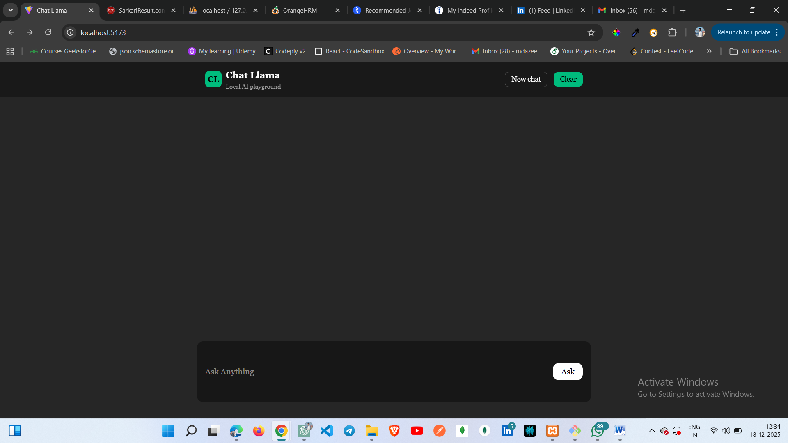
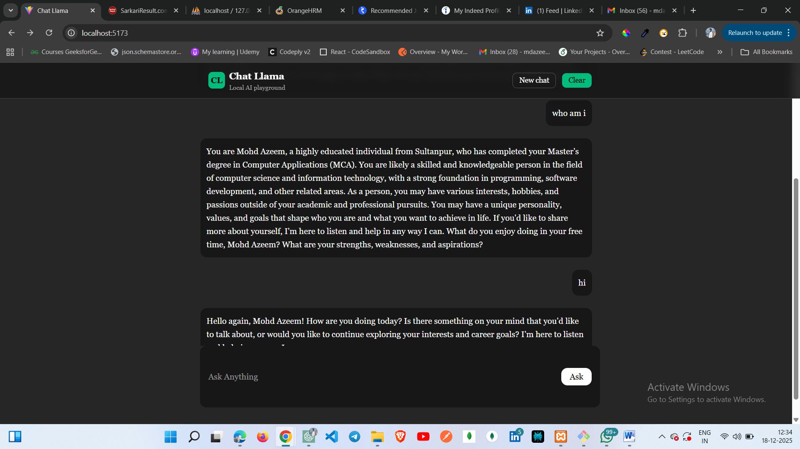

## Front End

### Features:
1. Clean and intuitive UI
2. Responsive design for all screen sizes
3. Fast client-side rendering
4. Smooth user interactions

## Back End

**Chat Llama** follows a monolithic backend architecture developed using Node.js and Express.js, ensuring simplicity, maintainability, and scalability.

The backend is responsible for handling authentication, business logic, AI communication, payments, and media storage, with a strong emphasis on security and performance.

##AI & APIs

* Llama Model
* Grok API
* Tavily API

### Technologies:

* Node.js
* Express.js
* React.js
* Grok_API
* Tavily_API

The back-end is focused on scalability, security, and performance.

## API Design

The **Chat Llama** uses Grok API and Tavily API  for the latest information and making communication:

* Grok API
    Enables natural language understanding, reasoning, and conversational intelligence.
* Tavily API
    Fetches real-time information from the web to ensure responses remain current and relevant.
  
Together, these APIs allow Chat Llama to deliver smart, context-aware, and up-to-date interactions.
